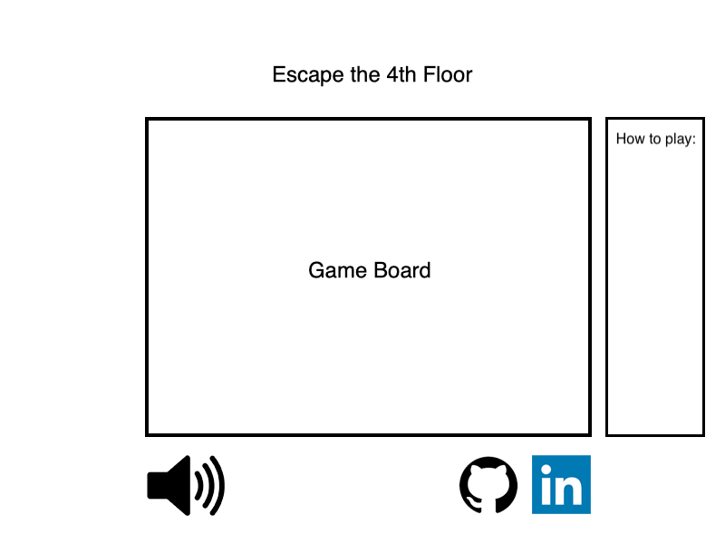

# Escape-the-4th-Floor

### Description

Escape the 4th Floor is a single player first-person game with a visualization of App Academy NYC's 4th floor computer lab. Users will be able to search around and find clues and solve challenges under a certain time in order to escape the room.

### MVP

In this game, users will be able to:

* Start, pause, and reset the game
* Music Toggle - On/Off
* Try to click on any possible object in the game
* Successfully click on functional objects that off a different cursor
* Solve riddles/challenges to proceed to the next task

This game will also include:

* Image objects placed all around the game
* Modals that'll open up when a functional object is clicked on and provide clues/challenges
* A production README
* Background music
* 3-5 minute timer, depending on difficulty

### Technologies, Libraries, APIs

* `Javascript` for game rendering
* `HTML5` for canvas-based effects

### Wireframes

This game will consist of a single screen game board with nav links underneath to the creator's Github, LinkedIn, and personal website. On the left will have a modal of directions of how to play. On the right will have a button to restart the game and also a music toggle for on/off.

### Implementation Timeline

Day 1: Brainstorm a storyline of what will be needed to escape, in terms of tasks necessary to complete, items to populate in the game, which items clickable, and challenges to post on the modal. Research and add images to an images folder in order to populate and css the placements.

Day 2: Create files to implement game logic as well as the background grid to transfer into `Board.js`. Populate items into the game and make certain items clickable to pop up a modal with text displayed.

Day 4: Implement logic for lock animation to be able to open the door to exit the room.

Day 5: Create splash page and endgame display. Create buttons to restart the game and to toggle music.
